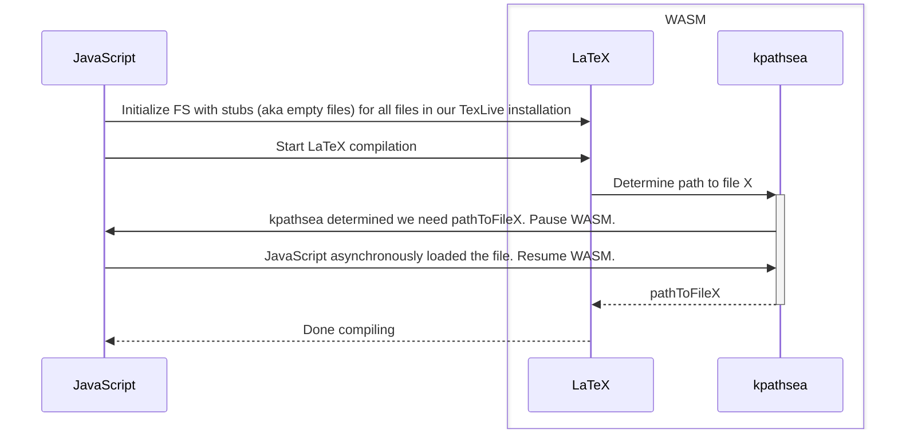

# Busytex Async

This project includes the following:

- `pdflatex`, `xetex`, `luatex`, `bibtex8` and some other Tex related tools compiled into a single [WASM](https://de.wikipedia.org/wiki/WebAssembly) binary which can run in browsers and NodeJS.<br>
      This is the excellent work of [Vadim Kantorov](https://github.com/vadimkantorov) done in [busytex/busytex](https://github.com/busytex/busytex).
- Some small modifications to the LaTeX sources to allow asynchronous loading of any latex packages that are required during compilation ([see below for details](#asynchronous-loading-of-latex-library-files)).
- A small TypeScript library to manage the WASM and the virtual file system.

### [Live demo](https://bnw.github.io/busytex-async/example/)


Usage example
-----
```typescript
const tugOrgTexLiveConfig: TexLiveConfig = {
    // We need to provide a list of all the files in our TexLive installation
    getTexLiveListOfFiles: () => {
        const newlineSeperatedFileList = fs.readFileSync("typescript/test/assets/TexLiveFilesTugOrg.txt");
        return Promise.resolve(newlineSeperatedFileList.toString().split("\n"));
    },

    // In this list of files we provided above, where is the folder containing the binaries?
    binFolder: "texlive/Contents/live/bin/x86_64-linux/",

    // If the WASM binary deciedes to actually read a file, we need to provide it.
    loadTexLiveFile: async (filepath: string) => {
        let result = await axios.get("https://tug.org/" + filepath, {responseType: 'arraybuffer'});
        return Promise.resolve(result.data);
    },

    // Bind stdout and stderr to the console
    print: console.log.bind(console),
    printErr: console.error.bind(console)
};

let busytexAsync = new BusytexAsync(tugOrgTexLiveConfig);
await busytexAsync.initialize();

// Load the files we want to compile into the virtual filesystem
busytexAsync.addFile("main.tex", ...);
busytexAsync.addFile("test.jpg", ...);

// Call one of the supported programs (see busytex.c for a list of supported programs)
await busytexAsync.run(["pdflatex", "test.tex"]);

// Read the result file from the virtual filesystem
const result = busytexAsync.readFile("test.pdf");
```

Asynchronous loading of LaTeX library files
-----
A major problem when doing LaTeX compilation in the browser is the very large size of a TexLive installation (over 10 GB).
This project solves this by utilizing the fact that LaTeX has a built-in central mechanism to locate files called [`kpathsea`](https://tug.org/kpathsea/).
When `kpathsea` determined the path to a file that we need, we pause the WASM execution (using [Emscripten's Asyncify](https://emscripten.org/docs/porting/asyncify.html)),
asynchronously load the missing file, and then continue the WASM execution.



Future work
-----
* Initializing the in-memory filesystem with stubs (aka empty files) for all files in a TexLive installation is slow (~ 15s).
  Instead, one could try to populate the file stubs in the in-memory filesystem on demand (like we do with the files).
  Most likely, this would require patching `libc` functions used list directories (`fopen`, `open`, ...?).
  
